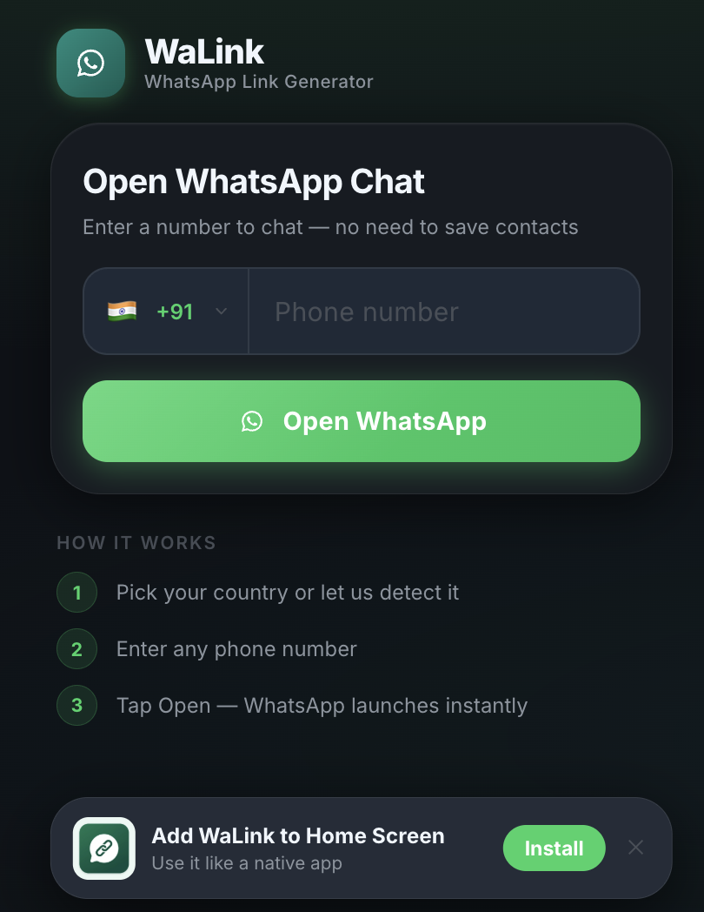

<div align="center">


<br/>
<br/>

**Open a WhatsApp chat with anyone — instantly. No saving contacts.**

[](https://g-akshay.github.io/walink/)
[](#)
[](#)
[](LICENSE)

<br/>



</div>

---

## What is WaLink?

WaLink is a zero-install, single-file Progressive Web App that generates a `wa.me` deep link for any phone number — letting you jump straight into a WhatsApp conversation without adding the person to your contacts first.

Send the `index.html` to a friend, open it in a browser, or install it to your home screen. It just works.

---

## Features

| | |
|---|---|
| **No contact saving** | Start a chat by typing any number — WhatsApp opens directly |
| **Remembers your country** | Saves your last selected dial code — no re-selecting on every visit |
| **Clipboard detection** | Tap the invite chip to paste a copied number in one step |
| **PWA — installable** | Add to home screen on iOS & Android; works offline |
| **Single HTML file** | Zero dependencies, zero build step — share a single file |
| **Privacy-first clipboard** | Never asks for clipboard permission on load; only when you tap "Paste" |

---

## Preview

<div align="center">

</div>

---

## Try it

**[👉 Open WaLink](https://g-akshay.github.io/walink/)**

Or download `index.html` and open it directly in any browser.

---

## How it works

```
1. Your last-used country dial code is pre-selected (defaults to India on first use)
2. Paste or type any phone number — country code is auto-detected if included
3. Tap "Open WhatsApp" → wa.me link opens the chat instantly
```

---

## Run locally

No build step needed — just serve the file:

```bash
# Python
python -m http.server

# Node.js
npx serve .
```

Then open `http://localhost:8000` (or the port shown).

---

## Project structure

```
walink/
├── index.html          ← self-contained app (CSS + JS inlined)
├── manifest.json       ← PWA manifest
├── sw.js               ← service worker (offline support)
├── assets/
│   ├── icons/          ← app icons (192px, 512px)
│   ├── css/styles.css  ← source stylesheet
│   └── js/app.js       ← source JavaScript
└── LICENSE
```

> `index.html` is the distributable — it has everything inlined. The `assets/` folder contains the source files for editing and the icons used by the PWA.

---

## Updating the installed PWA

Once installed, the app caches itself and won't automatically pick up new versions. To force an update:

**Android (Chrome)**

1. Open the installed WaLink app
2. Tap the **⋮ menu** (top right) → **Settings** → **Site settings**
3. Tap **Clear & reset** (or **Delete and reset**)
4. Close and re-launch the app — it will fetch the latest version

> If the ⋮ menu isn't visible, long-press the app icon on your home screen → **App info** → **Clear cache**, then re-launch.

**iOS (Safari)**

1. Go to **Settings** → **Safari** → **Advanced** → **Website Data**
2. Search for `g-akshay.github.io` and swipe to delete
3. Re-open the app from your home screen

**Quick version check** — the version number shown at the bottom of the app (e.g. `v1.0.2`) tells you exactly which build is running.

---

## Tech

- Vanilla HTML5 · CSS3 · ES6 — no frameworks, no bundler
- `localStorage` — persists last selected country across sessions
- Service Workers — offline caching via PWA

---

## License

[MIT](LICENSE) · Made with ♥ by [g-akshay](https://github.com/g-akshay)
